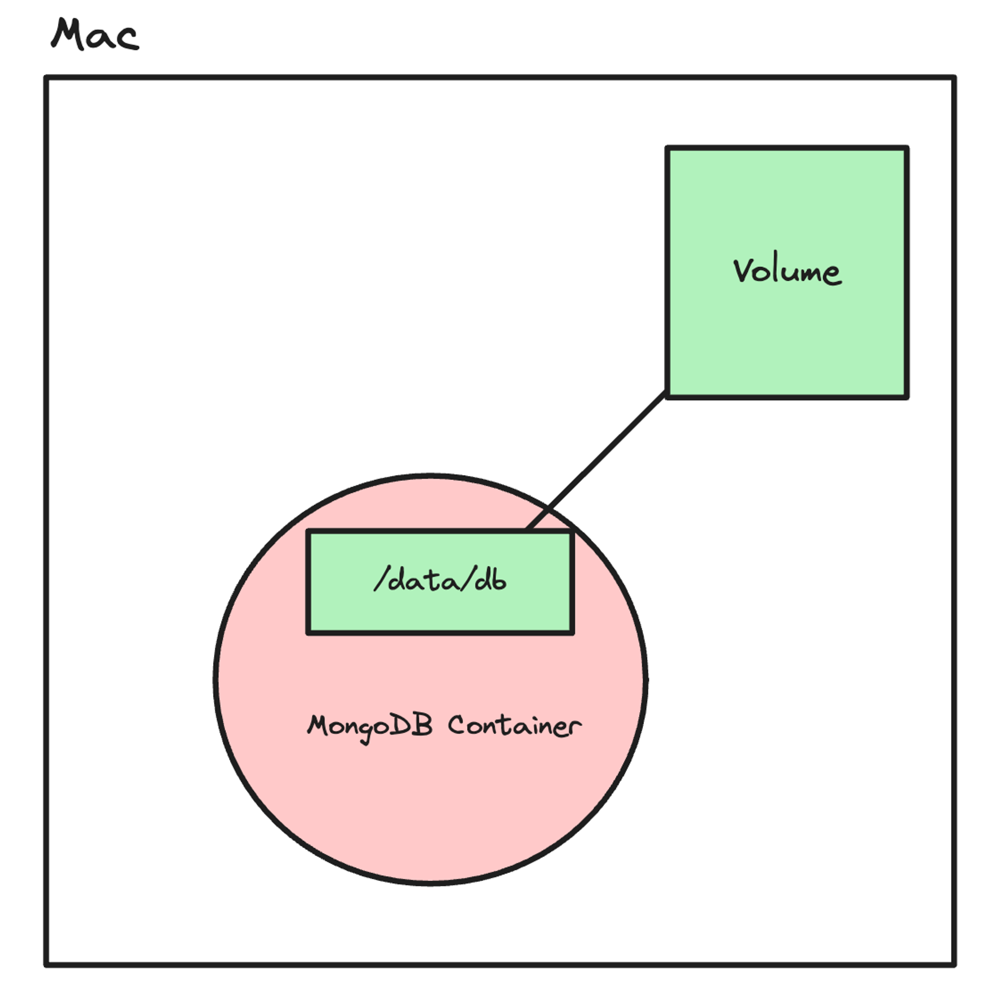
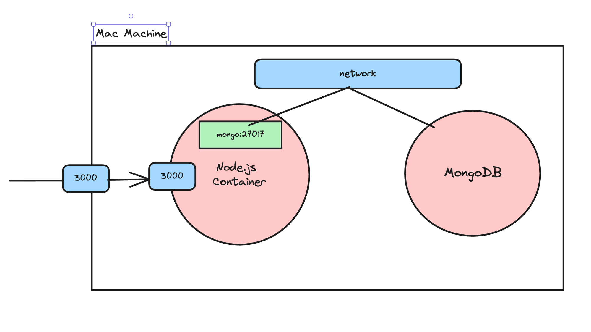

# Docker Cheatsheet

## Getting Started
- Start the docker daemon: `docker -d`

## Images
- Build an Image from a Dockerfile: `docker build -t <image_name> .`
- Build an Image from a Dockerfile without the cache: `docker build -t <image_name> . –no-cache`
- List local images: `docker images`
- Delete an Image: `docker rmi <image_name>`
- Remove all unused images: `docker image prune`

## Containers
- Create and run a container from an image, with a custom name: `docker run --name <container_name> <image_name>`
- Run a container and publish a container’s port(s) to the host: `docker run -p <host_port>:<container_port> <image_name>`
- Run a container in the background: `docker run -d <image_name>`
- See the logs of the background container: `docker logs <container_name>`
- Start or stop an existing container: `docker start|stop <container_name> (or <container-id>)`
- Remove a stopped container: `docker rm <container_name>`
- Open a shell inside a running container: `docker exec -it <container_name> sh`
- Fetch and follow the logs of a container: `docker logs -f <container_name>`
- Inspect a running container: `docker inspect <container_name> (or <container_id>)`
- List currently running containers: `docker ps`
- List all docker containers (running and stopped): `docker ps --all`
- View resource usage stats: `docker container stats`

    -d means detached mode and -it means interactive mode

## Docker Hub
- Login into Docker: `docker login -u <username>`
- Publish an image to Docker Hub: `docker push <username>/<image_name>`
- Search Hub for an image: `docker search <image_name>`
- Pull an image from a Docker Hub: `docker pull <image_name>`

## Volumes
- Create a new volume: `docker volume create <volume_name>`
- List all volumes: `docker volume ls`
- Remove a volume: `docker volume rm <volume_name>`
- Inspect a volume: `docker volume inspect <volume_name>`
- Mount a volume to a container: `docker run -v <volume_name>:<container_path> <image_name>`

example to mount a volume to a mongo container:
    
    docker run -v volume_database:/data/db -p 27017:27017 mongo

## Networks
- Create a netwrok: `docker network create my_custom_network` 
- Start the backend process with the network attached to it : `docker run -d -p 3000:3000 --name backend --network my_custom_network image_tag`
- Start mongo on the same network: `docker run -d -v volume_database:/data/db --name mongo --network my_custom_network -p 27017:27017 mongo`

    the url in the backend app should be `mongodb://<name of the databse>:27017/database`

